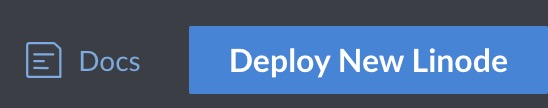
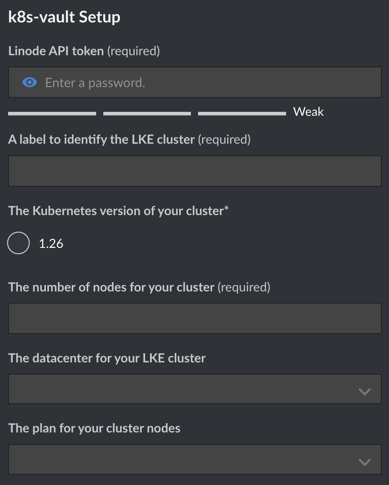
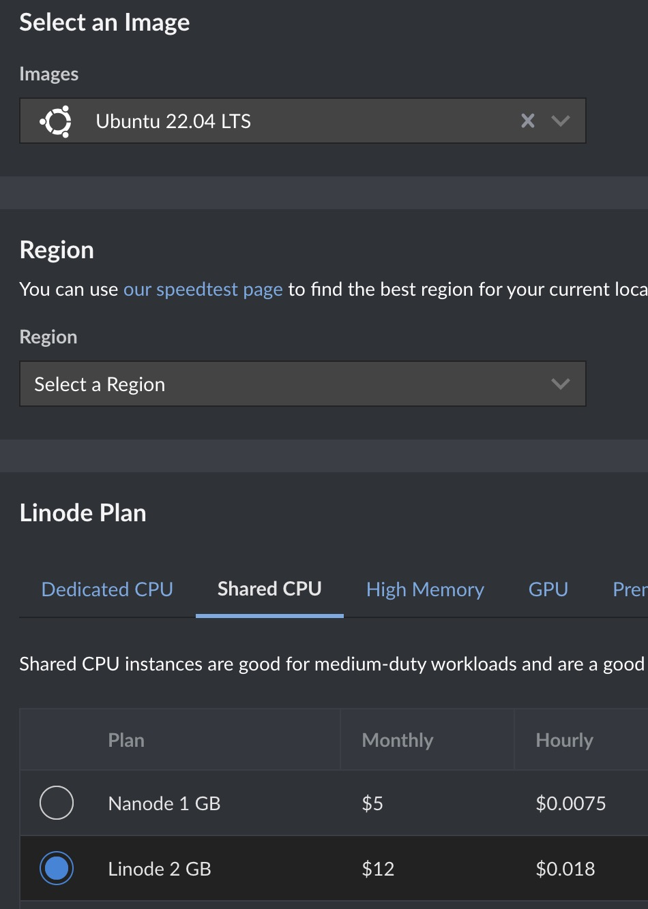
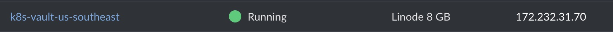
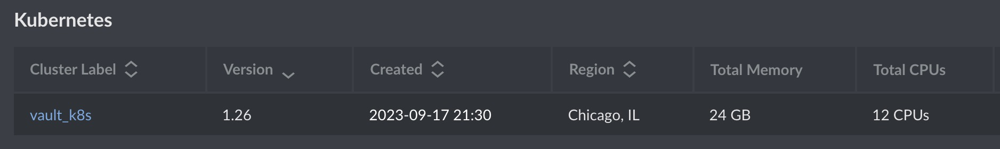
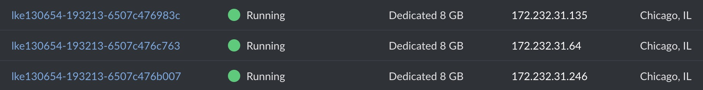
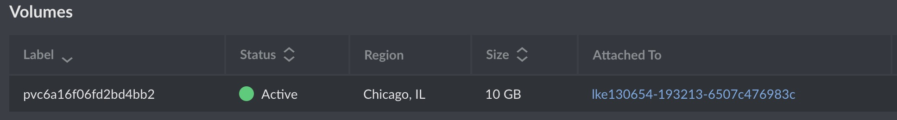
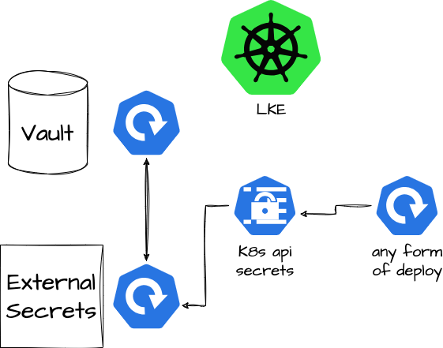
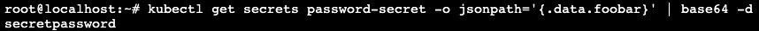

# Securing kubernetes secrets on LKE with vault/External secrets.

<p align="center">
  
</p>

This repo and guide provides an easy way to start using kubernetes secrets in a secure manner with the use of other tools. These tools, along with the small demo are all automated, but with enough knowledge of vault and external secrets you will be able to take advantage of this setup.

The guide assumes a bit of knowledge of hashicorp vault, external secrets and kubernetes, as it goes quickly over a very short overview.

Hashicorp Vault: HashiCorp Vault is an identity-based secrets and encryption management system. A secret is anything that you want to tightly control access to, such as API encryption keys, passwords, and certificates.

https://developer.hashicorp.com/vault/docs/what-is-vault

External Secrets: External Secrets Operator is a Kubernetes operator that integrates external secret management systems like AWS Secrets Manager, HashiCorp Vault, Google Secrets Manager, Azure Key Vault, IBM Cloud Secrets Manager, Akeyless, CyberArk Conjur and many more.

https://github.com/external-secrets/external-secrets

Since both have helm charts and can be used inside kubernetes clusters as any other service, this makes the setup easier to manage.

The setup does pretty much everything that is required, and has even a public linode stackscript you can use to deploy it. We recommend using this stackscript.

Basically a Linode vm is provisioned, which in turn executes the ansible scripts that set up everything in place.

In this first section the deployment process will be explained.

Login to linode, and access https://cloud.linode.com/stackscripts/1233285

1-Click on deploy new linode:

<p align="center">
  
</p>

2- Fill out the required fields:

<p align="center">
  
</p>

The most important fields:

API token: Required to create the LKE cluster, check https://www.linode.com/docs/products/tools/api/guides/manage-api-tokens/ and make sure your api token has LKE admin access.

Number of nodes: The number of nodes you want to create on your LKE cluster.

The data center of your LKE cluster: This will be the region where the LKE cluster will be placed.

The plan for your cluster nodes: The Linode plan for the LKE nodes, only dedicated cpu family can be chosen.

Next select the plan for the linode that will provision the setup. It can be a shared cpu linode.

<p align="center">
  
</p>


Then click, create linode.

<p align="center">
  
</p>

At the end there will be 3 entities created.

The linode that triggered the ansible script:

<p align="center">
  
</p>

A kubernetes cluster:

<p align="center">
  
</p>

<p align="center">
  
</p>

And, a  Linode volume (vault setup):

<p align="center">
  
</p>

All the required tools to manage the cluster and the objects will be installed on your linode box, you can either keep it for management, or just delete it and use your own setup.

After all this fancy deployment, what does it do?

<p align="center">
  
</p>

What this setup does is to run a Hashicorp vault inside kubernetes, and that way keep our secrets encrypted plus any benefit added of using vault (rotation, key management, etc). Through external secrets, we will be able to generate secrets in a secure manner using vault kubernetes authentication.

The demo setup this deployment incorporates are as follows:

-> Kubernetes auth setup: Just the way vault interfaces and authenticates everything the kubernetes cluster makes a request for a secret. It uses the default service account token.

→ A very simple secret will be created on vault site:

``` bash
vault kv put kv/path/to/my/secret password=secretpassword
```

→ Vault demo role: This role will be able to access vault keystore secrets on a defined namespace through a specific service account, in this case external secrets since it is our secret management tool.

``` bash
vault write auth/kubernetes/role/demo-role bound_service_account_names=external-secrets bound_service_account_namespaces=external-secrets policies=demo-policy ttl=24h
```

``` bash
vault write auth/kubernetes/login role=demo-role jwt="{{ demo_account_token }}" iss=https://kubernetes.vault.svc.cluster.local
```

At the very end, we will create two kubernetes objects that will allow us to manage and access the secrets.

These are the SecretStore and the ExternalSecret. 

SecretStore is a namespace specific resource and contains the authentication credentials details of the external secret manager that we want to access or want to make external API calls.

External secret describes what data is to be fetched and how it should be transformed and saved as a kind of secret. It has a reference to SecretStore/ClusterSecretStores which knows how to access the external secret manager data.

So basically our goal is to create a secretstore to access the secret we created on vault (password=secretpassword)

To do that, we will issue the following commands:

``` bash
cat << EOF | kubectl apply -f -
 apiVersion: external-secrets.io/v1beta1
 kind: SecretStore
 metadata:
   name: vault-backend
 spec:
   provider:
     vault:
       server: "http://vault.vault:8200"
       path: "kv"
       version: "v2"
       auth:
         kubernetes:
           mountPath: "kubernetes"
           role: "demo-role" #This is the role we created before.
EOF
```

``` bash
cat <<EOF | kubectl apply -f -
 apiVersion: external-secrets.io/v1beta1
 kind: ExternalSecret
 metadata:
   name: vault-example
 spec:
   secretStoreRef:
     name: vault-backend
     kind: SecretStore
   target:
     name: password-secret #Target secret name of the vault secret we will pull
   data:
   - secretKey: foobar #The key for the value
     remoteRef:
       key: path/to/my/secret #Path the we specified when we created the secret on vault
       property: password #The value field name we specified on vault
EOF
```

After that, if all went correctly, we should see a secret on our default namespace named password_secret with the data of the vault secret:

``` bash
kubectl get secrets password-secret -o jsonpath='{.data.foobar}' | base64 -d
```

<p align="center">
  
</p>

Reference docs:

https://blog.opstree.com/2023/08/08/introduction-to-external-secret-operator/


